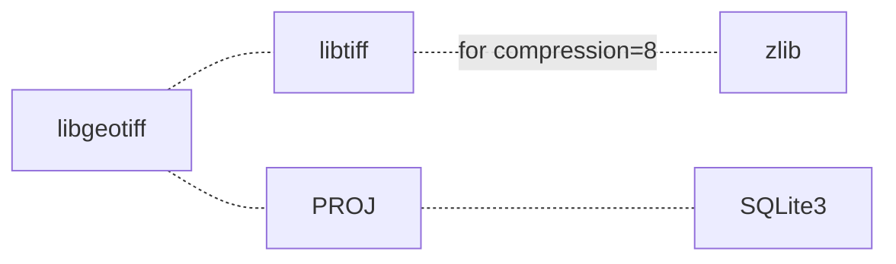
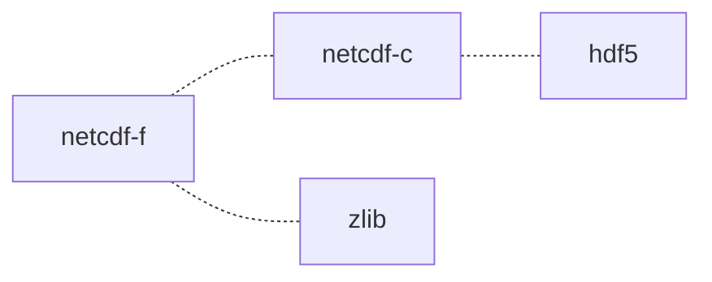

# 1 GCC/GFortran
## 1.1 依赖项
GMP MPFR MPC ISL<br />直接下载：`contrib/download_prerequisites`<br />gmp-6.2.1改名为gmp
## 1.2 编译和安装
`mkdir build & cd build`<br />`../configure  --disable-multilib --enable-languages=c,c++,fortran --enable-bootstrap`

可能报错当前文件夹不能在LIBRARY_PATH里：`export LIBRARY_PATH=`<br />可能报错符号无法识别，不能直接`make`，`-j4`为4进程并行：`env -i PATH=/bin:/usr/bin make -j4`<br />安装：`make install`

# 2 Intel Fortran
## 2.1 依赖项
GCC<br />包管理工具安装，或自行编译
## 2.2 安装
[https://software.intel.com/content/www/us/en/develop/tools/oneapi/base-toolkit/download.html](https://software.intel.com/content/www/us/en/develop/tools/oneapi/base-toolkit/download.html)<br />[https://software.intel.com/content/www/us/en/develop/tools/oneapi/hpc-toolkit/download.html](https://software.intel.com/content/www/us/en/develop/tools/oneapi/hpc-toolkit/download.html)
## 2.3 配置
`source /opt/intel/oneapi/setvars.sh --force>/dev/null`

# 3 Homebrew
国内源：<br />`/bin/zsh -c "$(curl -fsSL https://gitee.com/cunkai/HomebrewCN/raw/master/Homebrew.sh)"`
# 4 其他

zlib
```shell
./configure
make
make install
```
libtiff
```shell
cmake ./
make
make test
make install
```
SQLite3
```shell
CFLAGS="-DSQLITE_ENABLE_COLUMN_METADATA=1" ./configure #（GMT需要COLUMN_METADATA）
make
make install
```
PROJ
```shell
cmake .
cmake --build .
cmake --build . --target install

```
libgeotiff
```shell
./configure --with-proj=/usr/local
make
make install
```
usage: `geotifcp -c none ASTGTMV003_N00E006_dem.tif result.tif`


hdf5
```shell
CC=icc FC=ifort ./configure --prefix=/usr/local --enable-hl --with-zlib=/usr/local --enable-fortran
#CC=gcc FC=gfortran ./configure --prefix=/home/dev/src/hdf5 --enable-hl --with-zlib=/usr/local --enable-fortran
make
make install
```
netcdf-c
```
CC=icc ./configure --prefix=/usr/local
make
make install
```
netcdf-f
```shell
FC=ifort CC=icc CPPFLAGS=-I/usr/local/include LDFLAGS=-L/usr/local/lib ./configure --prefix=/usr/local
make
make install
```
cdf
```shell
make OS=linux ENV=gnu FORTRAN=yes FC_linux=gfortran all
# make OS=macosx ENV=gnu FORTRAN=yes FC_macosx=gfortran all
```
fftw
```shell
./configure CC=icc --enable-openmp
make
make install
```
